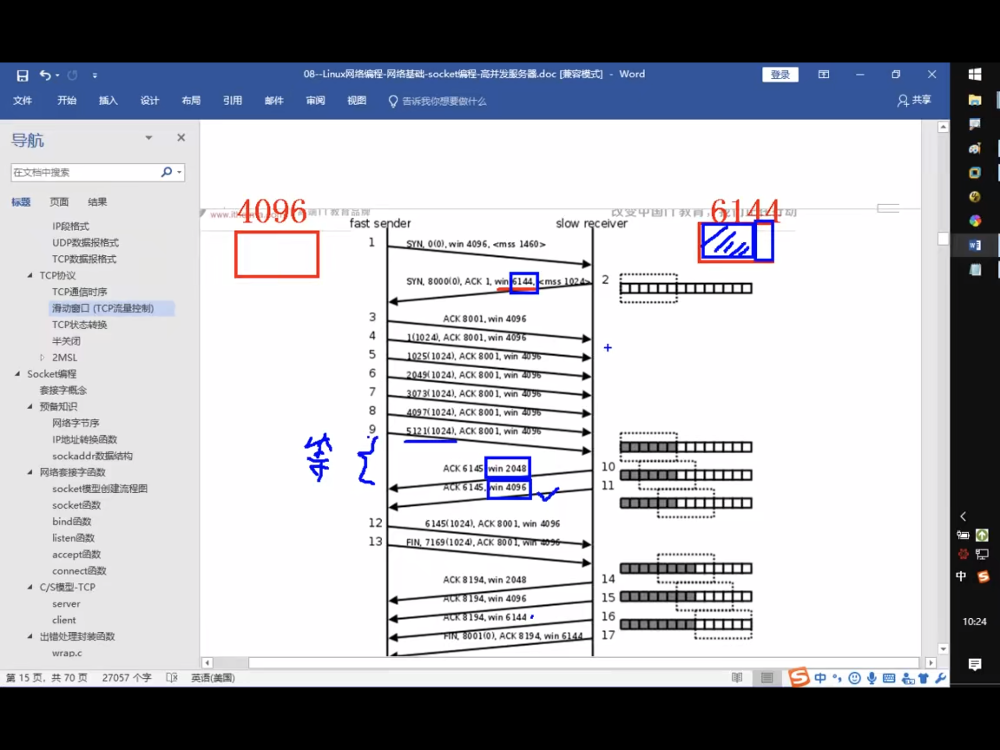
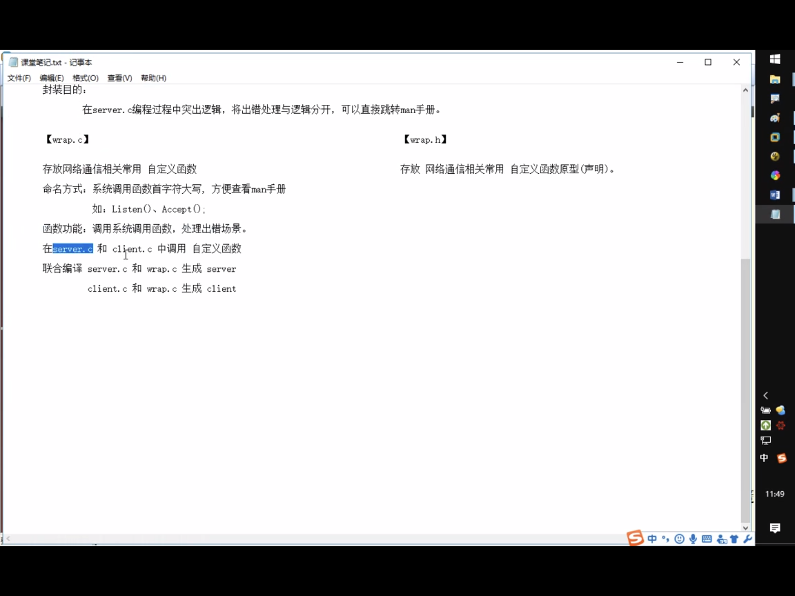

## 协议

一组规则。

## 分层结构

OSI ： 七层(5层)模型 ： 物，数，网，传，(会，表，)应

TCP/IP 4层模型： 网（链路层/网络接口层），网，传，应

应用层：http,ftp,nfs,ssh,telnet

传输层:TCP,UDP

网络层: IP ， ICMP, IGMP

链路层: 以太网帧协议，ARP

## 网路传输流程

数据没有封装之前，是不能在网络中传递的。


## 以太网帧协议

ARP协议：根据IP地址获取MAC地址

以太网帧协议：根据mac地址，完成数据包传输


## IP协议

版本： IPV4,IPV6  -- 4bits

TTL：time to live ， 设置数据包在路由节点中的跳转上限，每经过一个路由节点，该值-1，减为0的路由，有义务将该数据包丢弃

源ip：32bits   -- 4字节   192.168.1.108  -- 点分十进制 IP地址(string)  ---  二进制

目的ip: 32bits

IP 地址:可以在网络环境中唯一标识一台主机

端口号:可以在网络的一台主机上，唯一标识一个进程

ip地址+端口号:唯一标识一个进程

## UDP

16位 源端口号   2 ^ 16 = 65536

16位 目的端口号  

## TCP

16位 源端口号   

16位 目的端口号 

32位序号

32位确认序号

6个标志位

16位窗口大小

## bs vs cs

--- c/s模型: client-server  ---  b/s:browser-server

优点： 

      缓存大量数据                   安全性

      自定义协议                     跨平台

      速度快                        开发工作量较小

缺点

      安全性                        不能缓存大量数据
                                
      不能跨平台                     严格遵守HTTP

      开发工作量较大


## 网络套接字 socket

在通信过程中，套接字一定是成对出现

一个文件描述符指向一个套接字(该套接字内部由内核借助两个缓冲区实现) --> 一个读一个写

## 网络字节序

小端法(pc本地存储): 高位高地址，低位低地址

大端法(网络存储): 高位低地址，低位高地址

htonl  -- 本地 --> 网络(IP)  32bits   

htons  -- 本地 --> 网络(port) 16bits

ntohl  -- 网络 --> 本地(IP)  32bits

ntohs  -- 网络 --> 本地(port) 16bits

192.12.14.2 string --> atoi --> int --> htonl -->网络字节序

注意s 代表short,port只需要16bits, 而l是unsigned long，ip是32bits


## IP地址转换函数

int inet_pton(int af, const char * restrict src, void * restrict dst);

本地字节序(string IP)  -->  网络字节序

af: AF_INET, AF_INET6

src: IP(点分十进制)

dst: 传出，转换后的网络字节序的IP地址

返回值

成功: 1 

异常: 0, src指向的不是一个有效的IP地址

失败: -1

const char *inet_ntop(int af, const void * restrict src, char * restrict dst,
         socklen_t size);

af: AF_INET, AF_INET6

src:网络字节序IP地址

dst:本地字节序(string IP)

size:dst的大小


## sockaddr数据结构

```c
struct sockaddr_in addr;
addr.sin_family = AF_INET;  // man 7 ip
addr.sin_port = htons(9672);
/*
int dst;
inet_pton(AF_INET, "192.22.32.1", (void*)&dst);
addr.sin_addr.s_addr = dst;
*/
addr.sin_addr.s_addr = htonl(INADDR_ANY);  // INADDR_ANY表示取出系统中有效的任意IP地址，二进制类型
bind(df, (struct sockaddr*)&addr, size);
```

**为什么需要sin_addr.s_addr ???**

/*
 * Internet address (a structure for historical reasons)
 * 历史原因，还有种定义方式https://docs.microsoft.com/en-us/windows/win32/api/winsock2/ns-winsock2-in_addr
 */
struct in_addr {
	in_addr_t s_addr;
};


**为什么要使用struct sockaddr_in 然后转换成 struct sockaddr ?**

struct sockaddr和struct sockaddr_in这两个结构体用来处理网络通信的地址


sockaddr是一个通用的结构 主要是前两个字节，是定义地址类型外，其他的东西，没有详细定义，只是预留着，根据协议不同而变化。

而具体使用时 在不同的网络中用不同的结构区代替sockaddr，而在internet中我们常常用sockaddr_in去代替它，所以它的缺陷是：sa_data把目标地址和端口信息混在一起了，如下：

``` c
struct sockaddr {  
     sa_family_t sin_family;    //地址族,2字节，一般都是“AF_xxx”的形式
　　  char sa_data[14];     //14字节，包含套接字中的目标地址和端口信息               
　　 }; 
```

sockaddr_in 把port和addr 分开储存在两个变量中。

```c
struct sockaddr_in {
      sa_family_T sin_family;    // Address Family   2字节
      uint16_t sin_port;    // 16位TCP/UDP 端口号     2字节
      struct in_addr sin_addr;      // 32位IP地址     4字节
      char sin_zero[8];     // 不使用         8字节
}
```

二者长度一样，都是16个字节，即占用的内存大小是一致的，因此可以互相转化。二者是并列结构，指向sockaddr_in结构的指针也可以指向sockaddr。

sockaddr常用于bind、connect、recvfrom、sendto等函数的参数，指明地址信息，是一种通用的套接字地址。

sockaddr_in 是internet环境下套接字的地址形式。所以在网络编程中我们会对sockaddr_in结构体进行操作，使用sockaddr_in来建立所需的信息，最后使用类型转化就可以了。

一般先把sockaddr_in变量赋值后，强制类型转换后传入用sockaddr做参数的函数

sockaddr_in用于socket定义和赋值；sockaddr用于函数参数。

## socket模型创建流程


## socket函数

#include <sys/socket.h>

int socket(int domain, int type, int protocol);  //创建一个套接字

domain: AF_INET, AF_INET6, AF_UNIX

type: SOCK_STREAM , SOCK_DGRAM

protocol: 0,根据domain自动选择

返回值

成功: 新套接字所对应文件描述符

失败: -1 errno

## bind函数

int bind(int sockfd, const struct sockaddr *addr, socklen_t addrlen);

给socket绑定一个地址结构(IP+port)

sockfd: socket()返回值

```c
struct sockaddr_in addr;
addr.sin_family = AF_INET;
addr.sin_port = htons(8888);
addr.sin_addr.s_addr = htonl(INADDR_ANY);
```

addr: (struct sockaddr*)&addr;

addrlen: sizeof(addr);  //地址结构的大小

返回值:

成功: 0 

失败: -1 errno

## listen()

int listen(int sockfd, int backlog);

设置同时与服务器建立连接的上限数，(同时进行3次握手的客户端)

注意这个不是用来阻塞监听的，accept才是

sockfd:socket()返回值

backlog:上线数值，最大值128

## accept()

int accept(int sockfd, struct sockaddr *addr, socklen_t *addrlen);

阻塞风带客户端建立连接，成功的话，返回一个与客户端成功连接的socket文件描述符

sockfd:socket()返回值

addr:传出参数，成功与服务器建立连接的那个**客户端**的地址结构(IP+port)

对比bind，少个const,且注意这里是客户端，而bind是自身

addrlen:传入传出。 入:addr大小。出：客户端addr实际大小

socklen_t clit_addr_len = sizeof(addr);

&clit_addr_len

返回值

成功：能够与服务器进行数据通信的socket对应的文件描述符

失败： -1 errno

## connect()

int connect(int sockfd, const struct sockaddr *addr,
                   socklen_t addrlen);

使用先有的socket域服务器建立连接

sockfd: socket函数返回值

addr:传入参数。服务器的地址结构

```c
// init
struct sockaddr_in serv_addr;    // 服务器地址结构
serv_addr.sin_family = AF_INET;
serv_addr.sin_port = htons(SERV_PORT);
inet_pton(AF_INET, "服务器的IP地址", &serv_addr.sin_addr.s_addr);
```

addrlen:服务器地址结构的长度大小

看图socket直接过来connect，如果不适用bind绑定客户端地址结构，采用"隐式绑定".

## TCP通信流程分析

**server**:

实现见[server](../src/client_server/server.c)

1. socket() 创建socket

2. bind()  绑定服务器地址结构

3. listen() 设置监听上限

4. accept()  阻塞监听客户端连接

5. read(fd) 读socket获取客户端数据

6. 小--大写 toupper

7. write(fd) 

8. close()

当写完server测试时，可以先不写client,先利用 nc 命令测试 nc 127.0.0.1 9527

**client**:


实现见[client](../src/client_server/client.c)

1. socket() 创建 socket 

2. connect() 与服务器建立连接

3. write() 写数据到socket。

4. read() 读转换后的数据

5. 显示读取结果

6. close()


## TCP 通信


### 三次握手建立链接

主动发起连接请求端：发送SYN标志位，请求建立连接，携带序号，数据字节数(0),滑动窗口大小

被动接受连接请求端，发送ACK标志位，同时携带SYN请求标志位，携带序号，确定序号，数据字节数(0),滑动窗口大小

主动发起连接请求端，发送ACK标志位，应答服务器连接请求。携带确认序号。


### 数据传输


### 断开连接：四次挥手

主动关闭连接请求端，发送FIN标志位

被动关闭连接请求端，应答ACK标志位       

------- 半关闭完成

被动关闭连接请求端，发送FIN标志位

主动关闭连接请求端，应答ACK标志位 

------- 连接全部关闭


### 滑动窗口(TCP流量控制)

发送给连接对端，本段的缓冲区大小(实时),为了防止数据丢失



### 理论代码结合


## 错误封装



# 高并发服务器

## 多进程并发服务器

1. socket()  创建 监听套接字  lfd

2. Bind()   绑定地址结构 struct sockaddr_in addr;

3. listen()

4. 

```c
while(1) {
      cfd = accept();  //接收客户端连接请求
      pid = fork();
      if(pid == 0) { // 子进程read(cfd) --- 小 -> 大 --- write(cfd)
            close(lfd);  //关闭用于建立连接的套接字lfd
            read(cfd);
            /*
            小 -> 大
            */
           write(cfd);
      } else if(pid > 0) {
            close(cfd);   // 关闭用于与客户端通信的套接字cfd
            continue;
      }
}
```

5. 

- 子进程:

close(lfd);  

read(cfd);

小 -> 大

write(cfd);

- 父进程:

close(cfd);

注册信号捕捉函数: SIGCHLD

在回调函数中,完成子进程回收
      while(waitpid())

## 多线程并发服务器

1. socket()  创建 监听套接字  lfd

2. Bind()   绑定地址结构 struct sockaddr_in addr;

3. listen()

4.

```c
while(1) {
      cfd = accept(lfd, );
      pthread_create(&tid,, NULL, tfn, NULL);
      // pthread_join(tid, void**); //这个阻塞，但是得到线程回收时的返回值
      pthread_detach(tid); // 
}
```

5. 子线程

兄弟线程之间可以回收，但兄弟进程之间不可，需要借助信号量机制

```c
void *tfn(void* arg) {
      close(lfd);
      read(cfd);
      小 --> 大
      write(cfd);
      pthread_exit((void *)10);
}
```

## read函数返回值

1. > 0 实际读到的字节数

2. = 0 已经读到结尾(**对端已经关闭**) ！！！

3. -1 进一步判断errno的值

errno = EAGAIN or EWOULDBLOCK 设置了非阻塞方式读，没有数据到达

errno = EINTR 慢速系统调用被中断

errno = ”其他情况“异常

## TCP 状态转换

TCP


netstat -apn | grep client 查看状态

netstat -apn | grep 端口号


只有主动关闭连接方会经历TIME_WAIT状态

**Q : 为什么先关client可以立马在起，而先关server不能立马再启动**

等2 MSL，bind， already use


## 2MSL时长

一定出现在 主动关闭连接请求端 ---- TIME_WAIT

保证最后一个ACK成功被对端接收(等待期间，对端没收到我发的ACK，对端会再次发送FIN请求)

## 端口复用

```c
int opt = 1; // 0 or 1, 1表示设置端口复用

setsockopt(lfd, SOL_SOCKET, SO_REUSEADDR, (void*)&opt, sizeof(opt));
```

## 半关闭

通信双方中，只有一端关闭通信。 -- FIN_WAIT_2

close(fd)

shutdown(int fd, int how)

how : SHUT_RD, SHUT_WR, SHUT_RDWR

区别: shutdown 在关闭多个文件描述符应用的文件时，采用全关闭的办法，close只关一个

复习dup2(3,4)

将3的指针cp给4，3和4指向同一个文件


## select


int select(int nfds, fd_set *readfds, fd_set *writefds, fd_set *exceptfds, struct timeval *timeout);

参数:

nfds:监听的所有文件描述符中，最大的文件描述符+1

三个传入传出参数:

readfds: 读文件描述符监听集合

writefds: 写文件描述符监听集合 ， 一般NULL，不太常用

exceptfds: 异常写文件描述符监听集合， 一般NULL，不太常用

timeout: 

> 0 : 设置监听超时时长

NULL : 阻塞监听

0 : 非阻塞监听，轮询

返回值:

> 0 : 所有监听集合(3个)中，满足对应事件的总数

0 ： 没有满足监听条件的文件描述符

-1： errno

原理 ： 借助内核，select来监听，客户端连接，数据通信事件


void FD_ZERO(fd_set *set);  -- 清空一个文件描述符集合

void FD_SET(int fd, fd_set *set);  -- 将待监听的文件描述符，添加到监听集合中

void FD_CLR(int fd, fd_set *set); -- 将一个文件描述符从监听集合中移除

int  FD_ISSET(int fd, fd_set *set); -- 判断一个文件描述符是否在监听集合中
```c
fd_set rest;
FD_ZERO(&rest);

FD_SET(3, &rest);
FD_SET(5, &rest);
FD_SET(6, &rest);

FD_CLR(4, &rest);

FD_ISSET(4, &rest);

```

## select 实现对路IO转接设计思路

```c
lfd = socket();  // 创建套接字

bind();  // 绑定地址结构

listen();  // 设置监听上限

fd_set rset, allset;  // 创建监听集合

FD_ZERO(&allset);   // 将allset监听集合清空

FD_SET(lfd, &allset); // 将lfd添加至集合中

while(1){
      rset = allset;  // 保存监听集合

      ret = select(lfd+1, &rset, NULL, NULL, NULL);  // 监听文件描述符集合对应事件
      // 有监听的描述符满足对应事件
      if(ret > 0) { 
            if(FD_ISSET(lfd, &rset)) {  // 1在， 0不在
                  cfd = accept(); //建立连接，返回用于通信的文件描述符
                  FD_SET(cfd, &allset);  //添加到监听通信描述符集合中
                  for(i = lfd + 1; i <= 最大文件描述符; i++) {
                        FD_ISSET(i, &rset);  // 有read,write事件
                        read();
                        小 -- 大
                        write()
                  }
            }
}
 
}

```


select优缺点:

缺点：

监听上限受文件描述符限制。最大1024

检测满足条件的fd,自己添加业务逻辑提高效率，提高编码难度

优点: 跨平台

### 添加一个数组提高效率

## 多路IO转接

select 

poll

epoll

## poll

半成品，没啥优点，不需要掌握

int poll(struct pollfd *fds, nfds_t nfds, int timeout);

fds: 监听的文件描述符数组

```c
struct pollfd {
      int fd;     //待监听的文件描述符
      short events;     // 待监听的文件描述符对应的监听事件, POLLIN,POLLOUT,POLLERR
      short revents;    // 传入时，给0。如果满足对应事件，返回非0

}
```

nfds: 监听数组的，实际有效监听个数

timeout : 

>0 : 超时时长，这里是毫秒millisecond

-1 : 阻塞等待，#define INFTIM -1  Linux没有

0 : 不阻塞

返回值 : 返回满足对应监听事件的文件描述符 总个数


复习 read函数返回值

> 0: 实际读到的字节数

= 0 : socket中，表示对端关闭.close()

-1 : 如果 errno == EINTR 被异常中断，需要重启

     如果errno == EGAIN 或 EWOULDBLOCK， 以非阻塞方式读数据，但没有数据，需要再次读

     如果errno == ECONNRESET, 说明连接重置。需要close(),移除监听队列

     错误 

poll优点:

自带数组结构。可以将监听事件集合 和 返回事件集合分离

可以拓展监听上限,可以超出1024上限

缺点:

不能跨平台.linux

无法直接定位满足文件监听事件的文件描述符，编码难度较大

## 突破 1024 文件描述符限制


ulimit -a 

cat /proc/sys/fs/file-max --> 当前计算机所能打开的最大文件个数。受硬件影响

ulimit -a  -->  当前用户下的进程，默认打开文件描述符个数。缺省为1024

修改:

打开 sudo vim /etc/security/limits.conf 

*soft nofile 65535      -->设置默认值，可直接借助命令修改[注销用户，使其生效]

*hard nofile 100000     -->命令修改上限

## epoll

int epoll_create(int size)  --> 创建一颗监听红黑树

- para

size:创建的红黑树的监听结点数量.(仅供内核参考)

- return value:

指向新创建的红黑树的根节点的fd

失败: -1 errno

int epoll_ctl(int epfd, int op, int fd, struct epoll_event *event);   --> 操作监听黑红树

- para 

epfd: epoll_create 返回值

op: 对该监听红黑树所做的操作

EPOLL_CTL_ADD: 添加fd到监听红黑树

EPOLL_CTL_MOD: 修改fd在监听红黑树上的监听事件

EPOLL_CTL_DEL: 将一个fd从监听红黑树上摘下(取消监听)

fd: 待监听的事件

event: 本质struct epoll_event 结构体 地址

EPOLLIN / EPOLLOUT / EPOLLERR / ...

```c
typedef union epoll_data {
      void        *ptr;
      int          fd;  // 对应监听事件的fd
      uint32_t     u32;
      uint64_t     u64;
} epoll_data_t;

struct epoll_event {
            uint32_t     events;      /* Epoll events */
            epoll_data_t data;        /* User data variable */
      };
```


- return value:

成功 0 ， 失败 -1 errno

int epoll_wait(int epfd, struct epoll_event *events,
                  int maxevents, int timeout);  --> 阻塞监听

- para 

epfd : epoll_create 返回值

events : 传出参数，[数组],传出满足条件的fd结构体 

maxevents : 数组元素的总个数。

timeout : 超时时间

-1 : 阻塞

0 : 非阻塞

> 0 : 指定毫秒

- return value

> 0 : 满足监听的总个数。 可以用作循环上限

0 : 没有fd满足监听事件

-1 : 失败. errno


### epoll 实现多路IO转接思路

```c

lfd = socket()

bind()

listen()

int epfd = epoll_create(1024);    epfd，监听红黑树的树根

struct epoll_event tep, ep[1024];  // tep 设置单个fd属性，ep是epoll_wait()传出的满足监听事件的数组

tep.event = EPOLLIN;  // 初始化lfd的监听属性
tep.data.fd = lfd;

epoll_ctl(epfd, EPOLL_CTL_ADD, lfd, &tep);  // 将lfd添加到监听红黑树上

while(1) {
      ret = epoll_wait(epfd, ep, 1024, -1); //实施监听
      for(i = 0; i < ret; i++) {
            if(ep[i].data.fd == lfd) {  // lfd满足读事件，有新的客户端发起连接请求
                  cfd = Accept();
                  tep.event = EPOLLIN; // 初始化cfd的监听属性
                  tep.data.fd = cfd;
                  epoll_ctl(epfd, EPOLL_CTL_ADD,cfd, &tep);
            } else {   // cfd们满足读事件，有客户端写数据
                  n = read(ep[i].data.fd, buf, sizeof(buf));
                  if(n == 0) {
                        close(ep[i].data.fd);
                        epoll_ctl(epfd, EPOLL_CTL_DEL, ep[i].data.fd, NULL); // 将关闭的cfd从监听树上摘下
                  } else if(n > 0) {
                        小 -- 大;
                        write()
                  }
            }
      }
}


```

### epoll 事件模式

ET模式 ： 边沿触发

缓冲区剩余未读尽的数据不会导致epoll_wait返回，必须要有新的事件满足才会触发

有一种场景，发来500，我们只需要读前200就够了，比如预览模式，其他的都可以丢掉

```c
struct epoll_event event;

event.events = EPOLLIN | EPOLLET;
```

LT模式 : 水平触发 -- 默认采用模式

比如cient发来500字节，server先读300，然后把剩余200读走

(去看APUE高级IO里的readn和readline，为何封装，封装思想)

结论:

epoll的ET模式，高效模式，但是只支持非阻塞模式  --- 忙轮询

```c
struct epoll_event event;
event.events = EPOLLIN | EPOLLET;
epoll_ctl(epfd, EPOLL_CTL_ADD, cfd, &event);
int flag = fcntl(cfd, F_GETFL);
flag |= O_NONBLOCK;
fcntl(cfd, F_SETFL, flag);
```

epoll优点: 高效。能突破1024文件描述符

缺点: 不能跨平台

## epoll反应堆模型

epoll ET模式 + 非阻塞 + void *ptr

```c
// 自动回调
struct evt {
      int fd;
      void (*func)(int fd); // 回调函数
}*ptr;
```

原来: 

```c
socket,bind,listen 

epoll_create 创建监听红黑树，返回epfd

epoll_ctl()向书上添加一个监听fd

while:

epoll_wait 监听，对应监听fd有事件产生，返回监听满足数组

lfd满足,Accept , cfd满足 read -- 小 -> 大 -- Write

end

```

反应堆

```c
socket,bind,listen 

epoll_create 创建监听红黑树，返回epfd

epoll_ctl()向书上添加一个监听fd

while:

epoll_wait 监听，对应监听fd有事件产生，返回监听满足数组

lfd满足,Accept , cfd满足 read -- 小转大 -- cfd从监听红黑树上摘下,epoll_ctl()监听cfd的写事件--EPOLLOUT--回调函数--epoll_ctl()--EPOLL_CTL_ADD重新放回到红黑树上分监听写事件--等待epoll_wait返回--说明cfd可写--write回去--cfd从监听红黑树上摘下--EPOLLIN--epoll_ctl()--EPOLL_CTL_ADD重新放回到红黑树上分监听读事件--epoll_wait监听

end
// 总结 : 不但要监听cfd的读事件，还要监听cfd的写事件
```


eventset函数：

设置回调函数 : lfd -> acceptconn()

            cfd -> recvdata()

eventadd函数

将一个fd,添加到监听红黑树,设置监听read事件，还是write事件

网络编程中:

read --- recv()

write --- send()

## 线程池

https://blog.csdn.net/qq_36359022/article/details/78796784


线程池模块分析 

1. main()

创建线程池

向线程池中添加任务，借助回调处理任务

销毁线程池

2. pthreadpool_create()

创建线程池结构体指针

初始化线程池结构体(N个成员变量)

创建N个任务线程

创建一个管理者线程

失败时，销毁开辟的所有空间(释放)

3. threadpool_thread()

进入子线程回调函数

接收参数void *arg --> pool 结构体

加锁 --> lock  --> 整个结构体锁

判断条件变量  --> wait 

4. adjust_thread()

循环10s执行一次

进入管理者线程回调函数

接收参数void *arg --> pool 结构体

加锁 --> lock  --> 整个结构体锁

获取管理线程池要用到的变量。 task_num, live_num, busy_num

根据既定算法，使用上述3变量，判断是否应该创建，销毁线程池中 指定步长的线程

5. threadpool_add()

总功能 ：

模拟产生任务是 num[20]

设置回调函数，处理任务。 sleep(1)代表处理完成

内部实现:

加锁

初始化 任务队列结构体成员  回调函数function,arg

利用唤醒队列机制，实现添加任务，借助队尾指针挪移 % 实现

唤醒阻塞在 条件变量上的线程

解锁

6. 
